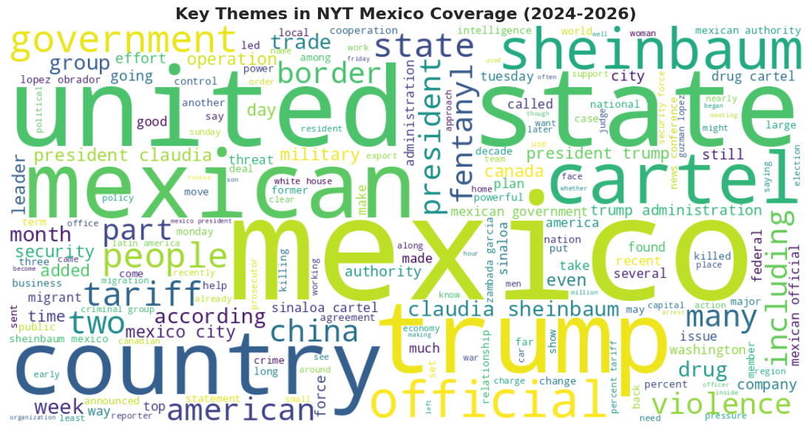
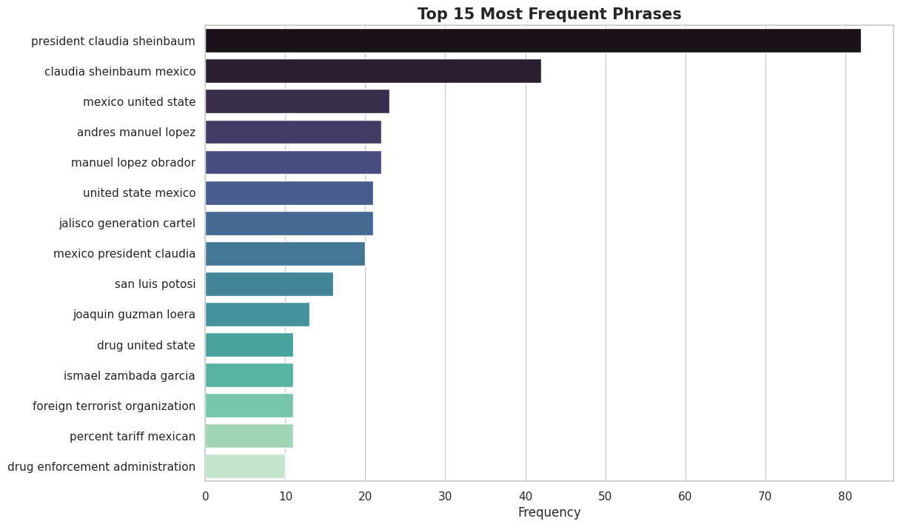
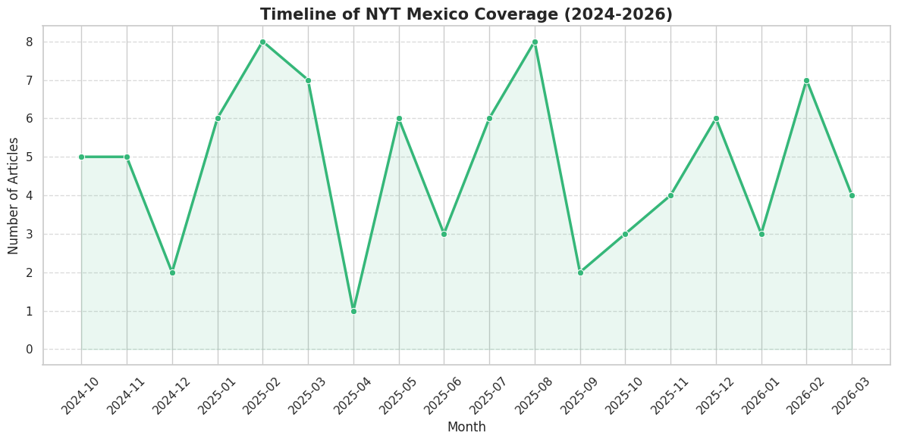
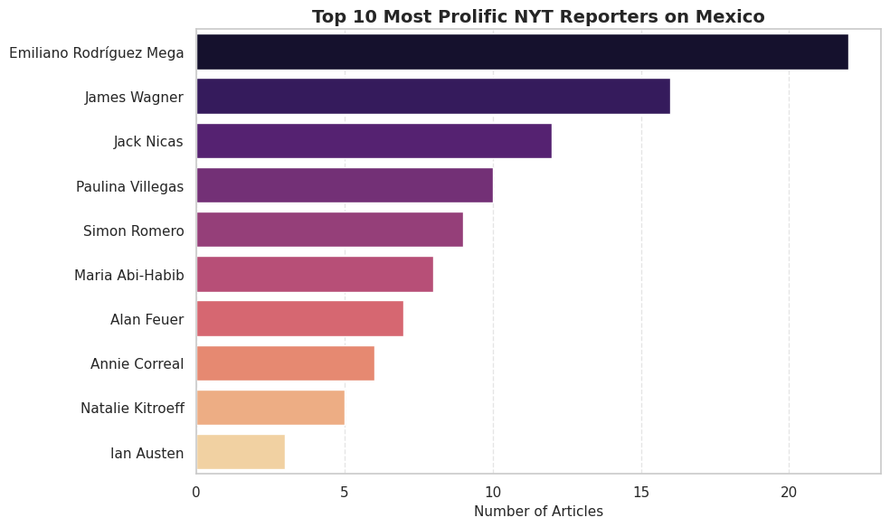
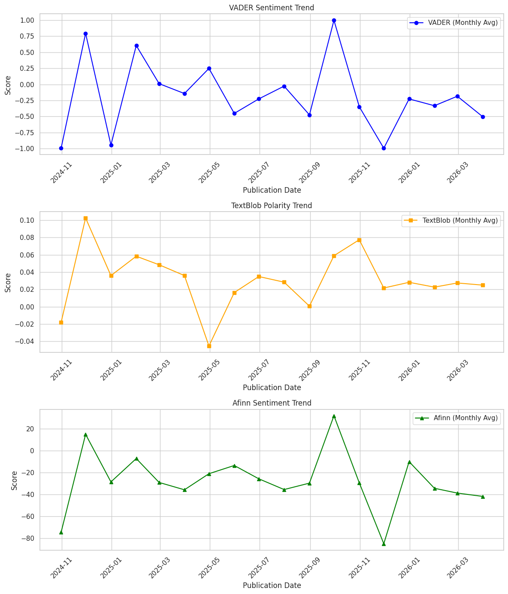

# 📰 Analyzing New York Times Coverage of Mexico: An NLP & Sentiment Analysis Pipeline


## 📌 Project Overview
This project explores and analyzes a dataset of 86 New York Times articles 
covering Mexico, with a specific focus on Claudia Sheinbaum's presidency and 
the country's security landscape (Oct 2024 - Mar 2026). The notebook walks 
through an end-to-end Data Science workflow: from Exploratory Data Analysis 
(EDA) and feature engineering to building a robust Natural Language Processing 
(NLP) pipeline and an XGBoost sentiment classification model.

> **Note:** Data collection was handled in a separate pipeline notebook using 
the NYT Article Search API. This repository contains the analysis notebook 
which begins with the cleaned, deduplicated dataset of 86 articles.

---

## 📂 Repository Structure
```
mexico-nlp-analysis/
│
├── README.md
├── NLP_Mexico_Analysis.ipynb
├── sample_data.csv
│
└── images/
    ├── wordcloud.png
    ├── top15_phrases.png
    ├── article_timeline.png
    ├── top10_reporters.png
    └── sentiment_trends.png
```

---

## 📊 Dataset

| Field | Details |
|-------|---------|
| Source | New York Times Article Search API |
| Full Text | Retrieved via institutional database access |
| Date Range | October 2024 — March 2026 |
| Final Articles | 86 (deduplicated from 240+ raw articles) |
| Unique Authors | 51 |
| Avg Article Length | ~977 words |

A 10-row sample of the dataset is available in `sample_data.csv`.

---

## 🚀 Key Features & Methodology

**Exploratory Data Analysis (EDA)**
- Engineered structural text features (word count, sentence density, 
character count)
- Analyzed journalistic trends including temporal coverage and author 
distribution
- Article lengths showed a bimodal distribution (peaks around 750 and 1,250 
words), identifying two distinct journalistic formats: short news briefs and 
long-form investigative pieces

**Advanced NLP Preprocessing**
- Built a custom noise-reduction pipeline including regex-based data masking 
(redacting PII like emails and phone numbers)
- Implemented context-aware tokenization using spaCy and custom stop-word 
filtering for journalistic boilerplate

**Semantic Vectorization**
- Constructed a TF-IDF Document-Term Matrix for salient n-gram extraction
- Trained a custom Word2Vec (Skip-gram) embeddings model to capture deep 
semantic relationships across the corpus

**Sentiment Analysis (Multi-Lexicon)**
- Extracted and compared sentiment polarity using VADER, TextBlob, and AFINN
- Applied time-series smoothing (monthly resampling) to visualize macro-level 
shifts in media tone

**Machine Learning (Weak Supervision)**
- Leveraged VADER compound scores to generate target binary labels
- Trained an XGBoost Classifier on document embeddings to predict article 
sentiment
- Engineered an interactive inference pipeline simulating a production 
environment for user-inputted text

---

## 🛠️ Tech Stack

- **Language:** Python
- **Data Manipulation:** Pandas, NumPy
- **NLP:** NLTK, spaCy, Gensim (Word2Vec), TextBlob, AFINN, 
Scikit-learn (TF-IDF)
- **Machine Learning:** XGBoost, Scikit-learn
- **Visualization:** Matplotlib, Seaborn, WordCloud, Squarify
- **Environment:** Google Colab

---

## 📈 Key Visualizations

### Key Themes in NYT Mexico Coverage


### Top 15 Most Frequent Phrases


### Article Frequency by Month


### Top 10 Most Prolific NYT Reporters on Mexico


### Sentiment Trends: VADER vs TextBlob vs AFINN


---

## 🔍 Key Findings

**Thematic Analysis**
- Word cloud and trigram analyses revealed heavy overlaps between political 
reporting and cartel activity (e.g., jalisco generation cartel, daily news 
conference, fentanyl united state), reflecting the defining issues of 
Sheinbaum's administration
- Emiliano Rodríguez Mega was identified as the most prolific contributor 
across 51 unique authors

**Sentiment Analysis**
- The corpus generally skews negative across all three tools, consistent with 
coverage focused on cartel violence and political tension
- VADER and AFINN registered strong negative signals throughout, with VADER 
frequently dipping below -0.5 and AFINN scores often below -50
- TextBlob showed a more neutral to slightly negative trend, suggesting 
journalistic language is perceived as more balanced by pattern-based scorers
- A notable negative spike in late 2025 was detected across all three tools

**Model Performance**

| Metric | Score |
|--------|-------|
| Accuracy | 77.78% |
| F1 Score | 0.78 |
| Precision | 0.79 |
| Recall | 0.79 |

> Note: Model was evaluated on an 18-article test set (80/20 split of 86 
articles). Results should be interpreted in the context of the small 
dataset size.

---

## ⚙️ How to Run

1. Clone the repository: 
`git clone https://github.com/YourUsername/mexico-nlp-analysis.git`
2. Install required libraries: 
`pip install pandas numpy nltk spacy gensim textblob afinn xgboost 
scikit-learn matplotlib seaborn wordcloud squarify`
3. Download the dataset and update the `file_path` variable in the notebook
4. Run all cells sequentially in Google Colab or Jupyter Notebook

---

## 📬 Contact

Feel free to connect with me on [LinkedIn](#) or reach out via email if you 
have questions about this project.
```
